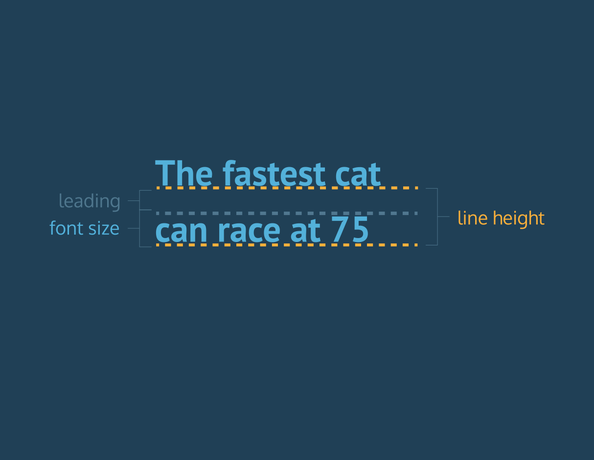

# General Development *Lingo*

## **Content**

#### Definitions

#### 1. HTML *Lingo*

#### Element Img

#### Definitions

>  1.1. `<form></form>` Tag
>
>  1.2. `<body></body>` Tag
>
>>     1.2.1. <h1></h1> to <h6></>
>>
>>     1.2.2  Lists
>>
>>>         1.2.2.1 <ol></ol> Ordered lists
>>>
>>>         1.2.2.2 <ul></ul> Un-oredered list
>>
>>     1.2.3  Anchors
>>
>>>         1.2.3.1 
>>>
>>>         1.2.3.2 
>
>  1.3. `

` Tag
>
>  1.4. `<head></head>` Tag
>
>      1.4.1 List of elements used in the <head></head> element
>
>  1.5 Labels
>
>>     1.5.1 ID Label
>>
>>     1.5.2 Classes Label
>>
>>>     1.5.2.1 Targeting specific Classes with same name
>>>
>>>     1.5.2.2 Elements with more than one class
>
>  1.6 `<tables></tables>` Tag
>>
>>     1.6.1 <tbody></tbody> Tag
>>
>>     1.6.2 <thead></thead> Tag
>>
>>     1.6.3 <tfoot></tfoot> Tag

#### 2. CSS *Lingo*

>   2.1 Basic structure of CSS
>>
>>    2.1.1 Multiple selectors
>
>   2.2 linking CSS and HTML together
>
>   2.3 Colors property
>
>>     2.3.1 rgb(Red, Green, Blue)
>>
>>>       2.3.1.1 rgba(Red, Green, Blue, Opacity)
>>
>>     2.3.2 hsl(Hue, Saturation, and Lightness)
>>
>>>       2.3.2.1 hsla(Hue, Saturation, and Lightness, Opacity)
>>
>>     2.3.3 hexadecimal color codes
>
>   2.4 Fonts
>
>>     2.4.1 Link to other fonts
>>
>>     2.4.2 Font-size property
>>
>>     2.4.3 PX
>>
>>     2.4.4 EM
>>
>>     2.4.5 % - Percentages
>>
>>     2.4.6 line-height property
>>
>>     2.4.7 Word-spacing property
>>
>>     2.4.8 Font-weight property
>>
>>     2.4.9 Font-style property
>>
>>     2.4.10 Text-transform property
>>
>>     2.4.11 Text-align property
>
>   2.5 Min and Max widths and hights property
>
>   2.6 Overflow property
>
>   2.7 Border-style property
>>
>>    2.7.1 Border-width property
>>
>>    2.7.2 Border-color property
>>
>>    2.7.3 Border-radius property
>
>   2.8 Shorthand Border Styling
>
>   2.9 Padding property
>
>   2.10 Margin property
>
>   2.11 User Agent Stylesheets
>
>   2.12 Display property
>
>   2.13 Visibility property
>
>   2.14 Box model
>
>   2.15 Position property
>>
>>    2.15.1 Position: Relative
>>
>>    2.15.2 Position: Absolute
>>
>>    2.15.3 Position: Fixed
>
>   2.16 Z-index Property
>
>   2.17 Float Property
>
>   2.18 Clear Property
>
>   2.19 Images and CSS
>
>   2.20 Background-Image Property
>
>   2.21 Background-Repeat Property
>
>   2.22 Background-Position Property
>
>   2.23 Shorthand Background Sty2.1.1 Multiple selectors
>
>   2.25 Background-Attachment Property

#### 3. JavaScript *Lingo*

>   3.1 Intro

#### 4. HTML Video Tutorials

#### 5. CSS Video Tutorials

#### 6. JavaScript Video Tutorials

#### 7. Setting Up A Vagrant Box

>   7.1 Create your project files and folders
>   7.2 Edit your Homestead.yaml file
>   7.3 Edit your /etc/hosts file in console with sudo nano /etc/hosts
>   7.4 Run vagrant reload --provisions

#### 8.Setting up Handlebars for a new project

>   8.1 Installing Handlebars.

#### 9 Udemy Course links

#### 10 RESTful Routes

### 1. HTML *Lingo*

#### Element Img

  

#### Definitions

| Index | Name | Definition |
|:-----:|:----:|:----------:|
| | Block-level elements  | elements that use an entire line of space in a web page and disrupt the natural flow of text. Most of the common HTML elements are block-level elements (headings, paragraphs, divs, and more).  |
| 1.0.1 | Boilerplate | The term "boilerplate code" is used to describe the basic HTML code required to begin creating a web |
| | Box model  | The CSS box model is essentially a box that wraps around every HTML element. It consists of: margins, borders, padding, and the actual content.  |
| | CSS background-color  | Background color refers to the color behind an element, styled with the background-color property.  |
| | Default Stylesheets  | User Agent Stylesheets or Browser Stylesheets |
| 1.0.2. | Elements | HTML element (or simply, element) - HTML code that lives inside of angle brackets. Angle Brackets is simply the less than and greater than brackets <></> |
| | CSS Foreground color | Foreground color refers to the actual color of an element, styled with the color property  |
| | HSLA | Hue, Saturation, and Lightness and Opacity (Not supported by some browswers) {color: hsla(123, 88, 9, 0.6);} |
| | HSL | Hue, Saturation, and Lightness (Not supported by some browswers) {color: hsl(123, 88, 9);} |
| | Inline elements  | Elements that display inline with text, without disrupting the flow of the text (like links)  |
| | RGBA  | Red, Green, Blue, Opacity (Not supported by some browswers){color: rgb(123, 88, 9, 0.5);} |
| | RGB  | Red, Green, Blue {color: rgb(123, 88, 9);} |
| | Shorthand Styling  | Shorthand properties are CSS properties that let you set the values of several other CSS properties simultaneously.  |
| | User Agent  | Is a technical term for the browser  |

  1.1. `<form></form>` Tag

    The HTML <form></form> tag is used for creating a form for user input. A form
    can contain textfields, checkboxes, radio-buttons and more. Forms are used to
    pass user-data to a specified URL.
    Any input form the client side will be submitted through the <form></form> tag.

  1.2. `<body></body>` Tag

    Before we can add content that a browser will display, we have to add a body
    to the HTML file.
    Once the file has a body, many different types of content can be added within
    the body, like text, images, buttons, and much more.

    1.2.1
      <h></h> elements can be placed in the <body></body> elements and range
      from h1 to h6

    1.2.2 List

        1.2.2.1 <ol></ol> Ordered lists is to make ordered lists within html

        example:

>         <ol>
>           <li>Russia</li>
>           <li>United States</li>
>           <li>Canada</li>
>         </ol>

        ouput:

          1. Russia
          2. Untited States
          3. Canada

        1.2.2.2 <ul></ul> Un-Ordered lists is to make un-ordered lists within html

        example:

>         <ul>
>           <li>Russia</li>
>           <li>United States</li>
>           <li>Canada</li>
>         </ul>

        output:

          * Russia
          * United States
          * Canada

    1.2.3  Anchors

        1.2.3.1 

          Is used to create a link to other domains.

        1.2.3.2 

          Is used to create a new tab when opening a link.

  1.3. `

` Tag

    HTML offers an element that is the backbone of code organization: the div,
    represented by 
 in HTML.

    You can think of the div as a box, or container, that groups elements that
    belong together.

      1. Keep HTML code easy to read.
      2. Group elements that belong together.

>       

>         <h1>Alice In Wonderland</h1>
>         
 ... 

>       

  1.4. `<head></head>` Tag

    The <head></head> element will contain information about the page that isn't
    displayed directly on the actual web page.
    This include <title></title> elements which is used to dispay information in
    the browser tab at the top.

    1.4.1. *List of elements used in the `<head></head>` element*
>   ##### `<title></title>`
>   ##### ``
>   ##### `<range></range>`
>   ##### `<nextid></nextid>`
>   ##### `<meta></meta>`
>   ##### `<link></link>`
>   ##### `<isindex></isindex>`
>   ##### `<base></base>`

  1.5 Labels

    1.5.1 ID Label

      With the proper labels, we can style individual HTML elements! Specifically,
      we can label HTML elements with a unique identifier, or ID. We can then
      style that specific element in the stylesheet.

      IDs are intended to label unique elements in an HTML file. No two HTML
      elements should ever share the same ID.
      To label an element with an ID, we can use the id attribute on an HTML element.

>       <h1 id="botswana">Botswana</h1>

      To style a specific element labeled with an ID, you can use an ID selector
      in the stylesheet.
      The ID would be called in CSS in the following manner using a hash character
      also known as the octothorpe character: #.

>       #botswana {
>         color: Blue;
>       }

    1.5.2 Classes Label

      For multiple elements that should share the same styling, classes can be
      used to label them.

      To label an element with a class, we can use the class attribute on an HTML
      element.

>       <h1 class="science">Scientist Discovers Important Cure</h1>

      To style elements of the same class, you can use a class selector in the
      stylesheet.
      Class selectors begin with a period (.) and are immediately followed by
      the name of the class.

>
>       .science {
>         text-transform: uppercase;
>       }

      1.5.2.1 Targeting specific Classes with same name

        The class selector targets all elements of a particular class.
        It's possible, however, for multiple elements on a web page to share a
        specific styling, but for one of those elements to differ slightly.

        You can see that the first example targets all classes named breaking
        and the second example only targets paragraphs with the class breaking.
        We will call this the element.class selector syntax

>         .breaking {
>           font-family: Georgia, Times, serif;
>         }
>
>         p.breaking {
>          line-height: 1.3em;
>         }

      1.5.2.2 Elements with more than one class

        It's also possible to label HTML elements with more than one class.When
        those same elements must also be differentiatedlabeling with an additional
        class is helpful.

        HTML elements can be labeled with many classes, but whenever possible,
        it's best to limit an element to four classes at most.

>         <h1 class="book domestic">The Way of the Deep</h1>
>
>         <h1 class="book foreign">A Night in the Sky</h1>

>         .book {
>           font-family: Georgia, serif;
>         }
>
>         .domestic {
>           font-color: #0902CC;
>         }
>
>         .foreign {
>           font-color: #B097DD;
>         }

  1.6 `<table></table>` Tag

    Before displaying data, you must first create the table that will contain the
    data by using the <table> element.

>     <table>
>
>     </table>

    The <table> element will contain all of the tabular data you plan on displaying.

    The first step in entering data into the table is to add rows using the table
    row element: <tr>.

>     <table>
>       <tr>
>       </tr>
>       <tr>
>       </tr>
>     </table>

    In the example above, two rows have been added to the table.

    Rows aren't sufficient to add data to a table. Each cell element must also
    be defined. In HTML, you can add data using the table data element: <td>.

>     <table>
>       <tr>
>         <td>73</td>
>         <td>81</td>
>       </tr>
>     </table>

   <table>
     <tr>
       <td>73</td>
       <td>81</td>
     </tr>
   </table>

    In the example above, two data points (73 and 81) were entered in the one row
    that exists. By adding two data points, we created two cells of data.

    If the table were displayed in the browser, it would show a table with one
    row and two columns.

    To add titles to rows and columns, you can use the table heading element: <th>.

    The table heading element is used just like a table data element, except with
    a relevant title. Just like table data, a table heading must be placed within
    a table row.

>     <table>
>       <tr>
>         <th></th>
>         <th scope="col">Saturday</th>
>         <th scope="col">Sunday</th>
>       </tr>
>       <tr>
>         <th scope="row">Temperature</th>
>         <td>73</td>
>         <td>81</td>
>       </tr>
>     </table>

       <th></th>
       <th scope="col">Saturday</th>
       <th scope="col">Sunday</th>
     </tr>
     <tr>
       <th scope="row">Temperature</th>
       <td>73</td>
       <td>81</td>
     </tr>
   </table>

    Note, also, the use of the scope attribute, which can take one of two values:

      1. row - this value makes it clear that the heading is for a row.

      2. col - this value makes it clear that the heading is for a column.

    HTML code for tables may look a little strange at first, but analyzing it
    piece by piece helps make the code more understandable.

    Data can span columns using the colspan attribute. The attributes accepts
    an integer (greater than or equal to 1) to denote the number of columns it
    spans across.

>     <table>
>       <tr>
>         <th>Monday</th>
>         <th>Tuesday</th>
>         <th>Wednesday</th>
>       </tr>
>       <tr>
>         <td colspan="2">Out of Town</td>
>         <td>Back in Town</td>
>       </tr>
>     </table>

  <table>
    <tr>
      <th>Monday</th>
      <th>Tuesday</th>
      <th>Wednesday</th>
    </tr>
    <tr>
      <td colspan="2">Out of Town</td>
      <td>Back in Town</td>
    </tr>
  </table>

    In the example above, the data Out of Town spans the Monday and Tuesday table
    headings using the value 2 (two columns). The data Back in Town appear only
    under the Wednesday heading.

    Data can also span multiple rows using the rowspan attribute.

    The rowspan attribute is used for data that spans multiple rows (perhaps an
    event goes on for multiple hours on a certain day). It accepts an integer
    (greater than or equal to 1) to denote the number of rows it spans across.

>     <table>
>       <tr> <!-- Row 1 -->
>         <th></th>
>         <th>Saturday</th>
>         <th>Sunday</th>
>       </tr>
>       <tr> <!-- Row 2 -->
>         <th>Morning</th>
>         <td rowspan="2">Work</td>
>         <td rowspan="3">Relax</td>
>       </tr>
>       <tr> <!-- Row 3 -->
>         <th>Afternoon</th>
>       </tr>
>       <tr> <!-- Row 4 -->
>         <th>Evening</th>
>         <td>Dinner</td>
>       </tr>
>     </table>

  <table>
    <tr> <!-- Row 1 -->
      <th></th>
      <th>Saturday</th>
      <th>Sunday</th>
    </tr>
    <tr> <!-- Row 2 -->
      <th>Morning</th>
      <td rowspan="2">Work</td>
      <td rowspan="3">Relax</td>
    </tr>
    <tr> <!-- Row 3 -->
      <th>Afternoon</th>
    </tr>
    <tr> <!-- Row 4 -->
      <th>Evening</th>
      <td>Dinner</td>
    </tr>
  </table>

    In the example above, there are four rows:

    The first row contains an empty cell and the two column headings.
    The second row contains the Morning row heading, along with Work, which spans
    two rows under the Saturday column. The "Relax" entry spans three rows under
    the Sunday column.
    The third row only contains the Afternoon row heading.
    The fourth row only contains the Dinner entry, since "Relax" spans into the
    cell next to it.

      1.6.1 <tbody></tbody> Tag

        Over time, a table can grow to contain a lot of data and become very long.
        When this happens, the table can be sectioned off so that it is easier to
        manage.

        Long tables can be sectioned off using the table body element: <tbody>.

        The <tbody> element should contain the all of the table's data, excluding
        the table headings (more on this in a later exercise).

      1.6.2 <thead></thead> Tag

        When a table's body is sectioned off, however, it also makes sense to
        section off the table's headings using the <thead> element.

        The table headings are contained inside of this element. Note that the
        table's head still requires a row in order to contain the table headings.

      1.6.3 <tfoot></tfoot> Tag

        The bottom part of a long table can also be sectioned off using the
        <tfoot> element.Footers are often used to contain sums, differences,
        and other data results.

### 2. CSS *Lingo*

  2.1 Basic structure of CSS

    CSS structure can be used in many ways.
    the basic structure being the following.

  

  2.1.1 Multiple selectors

    CSS does not limit you to selectors that target a single element or class.
    Using a multiple class selector is an efficient way of styling multiple HTML
    elements.

>     h1, p {
>       font-family: Garamond, serif;
>     }
>
>     .first, .last {
>       font-size: 20px;
>      }

  2.2 linking CSS and HTML together

    HTML and CSS can be linked using the <link/> tag or element inside of the head
    element in your HTML code.
    The struckture of the link element would typically look as follows.

>   `<link rel="stylesheet" href="style.css" type="text/css">`

    As jou can see the href target is set to "style.css", this tells the browswer
    that the CSS file is in the same directory as the HTML file.

    When linking a CSS file in a different directory it would typically look as
    follow.(No example added yet)

  2.3 Colors

    It is important to remember that not all browswers and versions of browsers
    support hsl, hsla and rgba and it is therefore neccesary to include other
    color options above the color used for the newest browsers.

    example:

>     .main {
>       color: rgb(23, 88, 9); (Browser will use this(top) color when un-supported)
>       color: rgba(23, 88, 9, 0.9); (If supported will use this lower one by default)
>     }

    Foreground color refers to the actual color of an element, styled with the
    color property.
    Background color refers to the color behind an element, styled with the background-color property.

    2.3.1 rgb(Red, Green, Blue)

>     h1 {
>       color: rgb(123, 88, 9);
>     }

      2.3.1.1 rgba(Red, Green, Blue, Opacity)

>       h1 {
>         color: rgba(123, 88, 9, 0.5);
>       }

    2.3.2 hsl(Hue, Saturation, and Lightness)

>     h1 {
>       color: hsl(182, 20%, 50%);
>     }

      2.3.2.1 hsla(Hue, Saturation, and Lightness, Opacity)

>       h1 {
>         color: hsla(239, 45%, 22%, 0.4);
>       }

    2.3.3 hexadecimal color codes

>     h1 {
>       color: #09AA34;
>     }
>
>     h1 {
>       color: #FFFFFF;
>       color: #FFF; (This is the same color as above)
>     }
>
>     h2 {
>       color: #AA33BB;
>       color: #A3B; (This is the same color as above)
>     }

  2.4 Fonts

    To change the typeface of text on your web page, you can use the font-family
    property.

>     h1 {
>       font-family: Garamond;
>     }

    When setting typefaces on a web page, keep the following points in mind:

    The font specified in a stylesheet must be installed on a user's computer
    in order for that font to display when a user visit the web page.

    The default typeface for all HTML elements is Times New Roman.

    It's a good practice to limit the number of typefaces used on a web page
    to 2 or 3.

    When the name of a typeface consists of more than one word, it must be
    enclosed in double quotes (otherwise it will not be recognized), like so:

>     h1 {
>       font-family: "Courier New";
>     }

    Most computers have a small set of typefaces pre-installed. This small set
    includes serif fonts and sans-serif fonts, like Times New Roman and Arial,
    respectively.

    When the stylesheet specifies a font not installed on a user's computer, the pre-installed fonts can be used as fallback fonts for users.

    To use fallback fonts, the following syntax is required:

>     h1 {
>       font-family: Garamond, Times, serif;
>     }

    The Browser will try each font from left to right until it finds the a font
    that is installed on the users device.

    2.4.1 Link to other fonts

      you can link to a specific Google Font in your HTML code and use it
      immediately in your stylesheet. Because the HTML file links directly to the
      Google Font, a user's browser can display the typeface you specify. This
      avoids having to determine whether or not that font is installed on a user's
      computer.

      To use a Google Font, you can use a <link> element, just like you did for
      a CSS stylesheet:

>       <head>
>         <link href="https://fonts.googleapis.com/css?family=Raleway"
>         type="text/css" rel="stylesheet">
>       </head

      In the example above, the href attribute is set to the following URL, which
      was retrieved from Google Fonts:
      The URL in the example above also specifies the Raleway typeface from Google
      Fonts.

    2.4.2 Font-size property

      To change the size of text on your web page, you can use the font-size
      property.

>       p {
>         font-size: 18px;
>       }

    2.4.3 PX

      px - Represents the unit of pixels. The display of a computer monitor can
      be measured in pixels. A pixel is a small point on the display. How small?
      Most computer monitors have a resolution of 72 pixels per inch, so a pixel
      represents about 1/72nd of an inch. Pixels are sometimes also referred to
      as points. Pixels are used to set the exact size of an element, in this c
      ase, text.

>       p {
>         font-size: 18px;
>       }

    2.4.4 EM

      ems - Pronounced just as it looks, "em." An em is equal to the width of
      the letter "m". Ems are a relative unit of measurement. They change the
      size of text relative to the parent element's size of text.

>       p {
>         font-size: 1.3em;
>       }

    2.4.5 % - Percentages

      % - Percentages are also a relative unit of measurement. The default size
      of text in web browsers is 16 pixels, or 16px. When percentages are used,
      they set the size of text relative to this default size. For example,
      setting the font size to 200% would be equivalent to setting it to 32px.

>       p {
>         font-size: 150%;
>       }

    2.4.6 line-height property

      Text on a web page must also be easy to read. When text is styled to appear
      larger, the vertical spacing between lines of text can decrease, creating
      text that is difficult to read, particularly in paragraphs.

      To avoid this problem, you can modify the spacing between lines of text
      with the line-height property.

      When the line height is increased, the spacing between lines of text increases, which can make text easier to read.

>       p {
>         line-height: 1.5em;
>       }

      When the line-height property of an element is modified, the leading is
      increased, resulting in an increase of the vertical spacing between lines
      of text.
      This means that when you increase the line-hight you can use larger font
      without changing the spacing between lines.

  

    2.4.7 Word-spacing property

      Word-spacing works in the same way as line_hight so does letter-spacing
      and all other related property's.
      The default amount of space between words is usually 0.25em.
      It's not common to increase the spacing between words, but it may help
      enhance the readability of bolded or enlarged text. Note, again, that the
      preferred unit is ems.

    2.4.8 Font-weight property

      In CSS, the font-weight property turns bold on or off.

>       p {
>         font-weight: bold;(normal numbers can be used ex: 100, 200, 300)
>       }

      Notice the 100 in the URL below. This specifies that you'd like to use a
      font weight of 100 when linking to the Roboto font. It's possible to
      specify a different font weight, or even multiple within the same URL.

>       <link href="https://fonts.googleapis.com/css?family=Roboto:100" rel="stylesheet">

    2.4.9 Font-style property

      font-style is used to set the font style between italic, normal and oblique

    2.4.10 Text-transform property

      Is used to tranform any text within your html to the following modes:

        capitalize
        full- width
        lowercase
        uppercase
        inherit(this will inheret from the parent element)

    2.4.11 Text-align property

      The text-align property can be set to one of the following three values:

        1. left - aligns text to the left hand side of the browser.
        2. center - centers text.
        3. right - aligns text to the right hand side of the browser.

  2.5 Min and Max widths and hights property

    Because a web page can be viewed through displays of differing screen size,
    the content on the web page can suffer from those changes in size. To avoid
    this problem, CSS offers two properties that can limit how narrow or how
    wide an element's box can be sized to.
    You can also limit the minimum and maximum height of an element.

      1. min-width - this property ensures a minimum width for an element's box.
      2. max-width - this property ensures a maximum width for an element's box.
      3. min-height - this property ensures a minimum height for an element's box.
      4. max-height - this property ensures a maximum height for an element's box.

>     p {
>       min-width: 300px;
>       max-width: 600px;
>       min-height: 150px;
>       max-height: 300px;
>     }

  2.6 Overflow property

    When the value of the max-height property is set too low, the contents will
    spill outside of the box. How can we ensure that this doesn't happen?

    The overflow property controls what happens to content when it spills, or overflows, outside of its box. It can be set to one of the following values:

      1. hidden - when set to this value, any content that overflows be hidden
         from view.
      2. scroll - when set to this value, a scrollbar will be added to the
         element's box so that the rest of the content can be viewed by scrolling.

>     p {
>       min-width: 300px;
>       max-width: 600px;
>       min-height: 150px;
>       max-height: 300px;
>       overflow: scroll;
>     }

  2.7 Border-style property

    It's not possible to view a box's border if the border's style has not been set. A border's style can be set with the border-style property. This property can take on one of the following values:

      1. solid - border is a solid line.
      2. dashed - border is a series of lines or dashes.
      3. dotted - border is a series of square dots.
      4. double - border is two solid black lines.
      5. groove - border is a groove (or carving).
      6. inset - border appears to cut into the screen.
      7. outset - border appears to pop out of the screen.
      8. ridge - border appears as a picture frame.
      9. hidden or none - no border.

>     p {
>       border-style: dashed;
>     }

    2.7.1 Border-width property

      You can control the thickness, or width, of borders with the border-width
      property. The value of border-width is given in pixels.

      It's also possible to also set the border-width property to one of the
      following named thicknesses:

        1. thin
        2. medium
        3. thick

>       p {
>         border-style: dashed;
>         border-width: 2px;
>       }

      the border-width property allows you to specify the width for each side of
      the border.

      The values in the example below refer to the border width in clockwise
      order (top: 3 pixels, right: 1 pixel, bottom: 2 pixels, left: 1 pixel).

>       p {
>         border-style: dashed;
>         border-width: 3px 1px 2px 1px;
>       }

      If you'd like to be even more specific about the width of different sides
      of the border, you can use the following properties:

      border-top-width
      border-right-width
      border-bottom-width
      border-left-width

      2.7.2 Border-color property

        The color of a border can also be customized with the border-color property.
        The border-color property accepts colors in various formats:
        Named colors, RGB(a) colors, and hex colors. It's common to use hex colors
        for borders, but you'll likely also come across RGB(a) colors as well.

>       p {
>         border-style: dashed;
>         border-width: 3px 1px 2px 1px;
>         border-color: #12AAF9;
>       }

      2.7.3 Border-radius property

        Thanks to CSS, a border doesn't have to be square.
        The corners of an element's border box can be modified with the border-radius property.

        The code in the example below will set all four corners of the border to
        a radius of 5 pixels (i.e. the same curvature that a circle with radius
        5 pixels would have).

>       p {
>         border: 3px solid rgb(22, 77, 100);
>         border-radius: 5px;
>       }

        You can create a border that is a perfect circle by setting the radius
        equal to the height of the box, or to 100%.

>       p {
>         border: 3px solid rgb(22, 77, 100);
>         border-radius: 100%;
>       }

  2.8 Shorthand Border Styling

    The shorthand way of setting border style, width, and color can be achieved
    with the border property.

    Note that the border property includes all of the properties that we previously
    styled individually: width, style, and color.

    It's considered best practice to follow the width-style-color order when using
    the border property.

>       p {
>         border-style: dashed;
>         border-width: 3px 1px 2px 1px;
>         border-color: #12AAF9;
>       }

>       p {
>         border: 3px solid rgb(22, 77, 100);
>       }

  2.9 Padding property

    The space between the contents of a box and the borders of a box is known as
    padding. In CSS, you can modify this space with the padding property.

    The code in the example will put 10 pixels of space between the content of
    the paragraph (the text) and the box borders, on all four sides.

    The padding property is particularly useful at making text easier to read when
    the text has a border around it.

    When padding is set for a box (as in the example above) it will be added to
    the width and height of a box, increasing the dimensions of the box.

>       p {
>         border: 3px solid #A2D3F4;
>         padding: 10px;
>       }

    padding can also be used for each corner seperately.

>       p {
>         border: 3px solid #A2D3F4;
>         padding: 10px 5px 9px 2px;/*Top, Right, Bottom, Left*/
>       }

    When you're certain that the top and bottom values for padding will equal
    each other, and that the left and right values for padding will also equal
    each other, you can use the following shortcut:

>       p {
>         border: 3px solid #A2D3F4;
>         padding: 10px 2px;
>       }

    If you want to be even more specific about the amount of padding on each side
    of a box's content, you can use the following properties:

      1. padding-top
      2. padding-right
      3. padding-bottom
      4. padding-left

  2.10 Margin property

    The margin refers to the space directly outside of the box. You can adjust
    this spacing with the margin property.

    The code in the example below will place 20 pixels of space on the outside of
    the paragraph's box, on all four sides. This means that other HTML elements
    on the page cannot come within 20 pixels of the paragraph.

>     p {
>       border: 3px solid #A2D3F4;
>       margin: 20px;
>     }

    Like all the other properties margin can also has a shorthand option to control
    each side seperately.
    The same shortcuts apply in all aspects.

      1. margin-top
      2. margin-right
      3. margin-bottom
      4. margin-left

>       p {
>         margin: 20px 10px 20px 10px;
>       }
>
>       p {
>         margin: 20px 10px;/*This is the same as the example above*/
>       }

    The margin property also lets you center content, if you follow certain
    requirements.

    In order to center an element, a width must be set for that element.
    Otherwise, the width of the div will be automatically set to the full width
    of its containing element, like the <body>, for example. It's not possible,
    therefore, to center an element that takes up the full width of the page.

  2.11 User Agent Stylesheets

    All major web browsers have a default stylesheet they use in the absence of an external stylesheet. These default stylesheets are known as user agent stylesheets. In this case, the term "user agent" is a technical term for the browser.

    User agent stylesheets often have default CSS rules that set default values for padding and margin. This affects how the browser displays HTML elements, which can make it difficult for a developer to design or style a web page.

    Many developers choose to reset these default values so that they can truly work with a clean slate.

>     p {
>       padding: 0;
>       margin: 0;
>     }

  2.12 Display property

    In CSS, you can change the default behavior of elements with the display
    property.

    Modifying the display property of an element can help achieve a desired layout
    for a web page. The display property can take on one of four values:

      1. inline - causes block-level elements (like a div) to behave like an inline
         element (like a link).

      2. block - causes inline elements (like a link) to behave like a block element
         (like a div).

      3. inline-block - causes block-level elements to behave like an inline element,
         but retain the features of a block-level element.

      4. none - removes an element from view. The rest of the web page will act as if
         the element does not exist.

  2.13 Visibility property.

    Elements can be hidden from view with the visibility property.

    The visibility property can be set to one of the following values:

      1. hidden - hides an element.
      2. visible - displays an element.

>     <ul>
>       <li>Explore</li>
>       <li>Connect</li>
>       <li class="future">Donate</li>
>     <ul>
>
>     .future {
>       visibility: hidden;
>     }

    Keep in mind, however, that users can still view the contents of the list item
    (e.g., Donate) by viewing the source code in their browser. Furthermore, the
    web page will only hide the contents of the element. It will still leave an
    empty space where the element is intended to display.

    Note: What's the difference between display: none and visibility: hidden? An
    element with display: none will be completely removed from the web page. An
    element with visibility: hidden, however, will not be visible on the web page,
    but the space reserved for it will.

  2.14 Box model

    The box model has an awkward limitation regarding box dimensions.
    This limitation is best illustrated with an example.

>     h1 {
>       border: 1px solid black;
>       height: 200px;
>       width: 300px;
>       padding: 10px;
>     }

    In the example above, a heading element's box has solid, black, 1 pixel thick
    borders. The height of the box is 200 pixels, while the width of the box is
    300 pixels. A padding of 10 pixels has also been set on all four sides of the
    box's content.

    Unfortunately, under the current box model, the border thickness and the
    padding will affect the dimensions of the box.

    The 10 pixels of padding increases the height of the box to 220 pixels the
    width to 320 pixels. Next, the 1 pixel thick border increases the height to
    221 pixels and the width to 321 pixels.

  

    Many properties in CSS have a default value and don't have to be explicitly
    set in the stylesheet.

    For example, the default font-weight of text is normal, but this property-value
    pair is not typically specified in a stylesheet.

    The same can be said about the box model that browsers assume. In CSS, the
    box-sizing property controls the type of box model the browser should use when interpreting a web page.

    The default value of this property is content-box. This is the same box model
    that is affected by border thickness and padding.

    Fortunately, we can reset the entire box model and specify a new one:
    border-box.

>     * {
>       box-sizing: border-box;
>     }

    The height of the box would remain at 200 pixels and the width would remain
    at 300 pixels. The border thickness and padding would remain entirely inside
    of the box.

  

  2.15 Position property

    The default position of an element can be changed by setting its position property. The position property can take one of four values:

      1. static - the default value (it does not need to be specified)
      2. relative
      3. absolute
      4. fixed

    2.15.1 Position: Relative

      One way to modify the default position of an element is by setting its position property to relative.

      This value allows you to position an element relative to its default position the web page.

>       iv.description {
>         background-color: #1D09AF;
>         width: 50px;
>         height: 50px;
>         position: relative;
>         top: 50px;
>         left: 75px;
>       }

      In the example above, the div has been positioned using two of the four offset properties. The valid offset properties are:

        1. top - moves the element down.
        2. bottom - moves the element up.
        3. left - moves the element right.
        4. right - moves the element left.

      In the example above, the div will be moved down 50 pixels and to the right
      75 pixels. Units for offset properties can be specified pixels, ems, or
      percentages. Note that offset properties will not work if the position of the
      element is not set to relative.

    2.15.2 Position: Absolute

      When an element's position is set to absolute, all other elements on the
      page will ignore the element and act like it is not present on the page.

>       div.description {
>         background-color: #1D09AF;
>         width: 50px;
>         height: 50px;
>         position: absolute;
>       }

      Unlike the relative value, the code in the example is valid. The div will
      be pinned down to its current position. Unfortunately, if offset properties
      aren't specified, it's possible for the div's content to overlap with other
      content on the page, especially since other elements with ignore the div.

      Offset properties can be set in order to avoid this problem. The specific
      offset values will depend on what makes the best sense for the content of
      a web page.

>       div.description {
>         background-color: #1D09AF;
>         width: 50px;
>         height: 50px;
>         position: absolute;
>         left: 250px;
>       }

    2.15.3 Position: Fixed

      We can fix an element to a specific position on the page
      (regardless of user scrolling) by setting its position to fixed.

>       div.navigation {
>         position: fixed;
>         height: 50px;
>         width: 100%;
>       }

      In the example above, the div will remain fixed to its position no matter
      where the user scrolls on the page. This technique is used often for
      navigation bars on a web page.

      It's still possible, however, for content (like text) to overlap other
      content when using this position. One solution is to set an opaque
      background color for the element.

>       div.navigation {
>         position: fixed;
>         background-color: #4BF5FF;
>         height: 50px;
>         width: 100%;
>       }

      The opaque background color will prevent any other content on the page
      from overlapping with any content inside of the div.

  2.16 Z-index Property

    The z-index property controls how far "back" or how far "forward" an element
    should appear on the web page.

    It can also be described as setting the layer on which the element sits.
    If the z-index is set to 0 and the position is set to fixed the content of
    other elements would be visible through the element which has a z-index of 0

    The z-index property accepts integer values. Depending on their values, the integers instruct the browser on the order in which elements should be displayed on the web page.

  2.17 Float Property

    If you're simply interested in moving an element as far left or as far right
    as possible on the page, you can use the float property.

    The float property can be set to one of two values:

      1. left - this value will move, or float, elements as far left as possible.
      2. right - this value will move elements as far right as possible.

>       div.block {
>         width: 100px;
>         float: left;
>       }

    When an element is floated, any other content within the same containing
    element will naturally flow around the element.

    Floated elements must have a width specified, as in the example above.
    Otherwise, the element will assume the full width of its containing element, and attempting to float the element may not yield any visible results.

  2.18 Clear Property

    The clear property specifies how elements should behave when they bump into
    each other on the page. It can take on one of the following values:

      1. left — the left side of the element will not touch any other element
         within the  same containing element.

      2. right — the right side of the element will not touch any other element
         within the same containing element.

      3. both — neither side of the element will touch any other element within
         the same containing element.

      4. none — the element can touch either side.

>       div {
>         width: 200px;
>         float: left;
>       }
>
>       div.special {
>         clear: left;
>       }

      In the example above, all divs on the page are floated to the left side.
      The div with class special did not move all the way to the left because a
      taller div blocked its positioning. By setting its clear property to left,
      the special div will be moved all the way to the left side of the page.

  2.19 Images and CSS

    As with any other element, the dimensions of an image can be set with the
    height and width properties.

    Specifying the dimensions of an image helps the browser determine how much
    space should be reserved for the image.

    Note: Images should be saved at the dimensions they will be displayed in on
    the web page. Using dimensions for an image that exceed the original dimensions
    will distort the image.

    Images can also be centered, but first, their default behavior must be changed. By default, images are inline elements. For images to center properly, they must behave as block-level elements.

>     img.leaf {
>       width: 300px;
>       height: 200px;
>       display: block;
>      }

    In the example above, the image's display property has been set to block. Now the image can be aligned as a block-level element.

>     img.leaf {
>       width: 300px;
>       height: 200px;
>       display: block;
>       margin: 0px auto;
>     }

    In the example above, the image is aligned using the margin property. The top
    and bottom margins of the image's box are set to 0 margin. The left and right
    margins are set to auto, which automatically sets the exact amount of margin
    needed on the left and right sides in order to center the image.

    Note: To align images to the left or right side of a page, you can use the
    float property you learned about earlier.

  2.20 Background-Image Property.

    Images can also be added to the backgrounds of HTML elements with the
    background-image property.

>     body {
>       background-image: url("https://www.example.com/leaf.jpg");
>     }

    The background-image can be set to a value of url().

    1. url() - contains the URL of the image, enclosed in double quotes.

    In the example above, the background of the body will be set to the image
    specified in double quotes. This technique can be used on nearly any HTML
    element.

    The background-image also supports color gradients.

>     background-image: -webkit-linear-gradient(#DA2312, #99AC43);

  2.21 Background-Repeat Property

    You can control how a background image repeats with the background-repeat
    property. This property can take one of four values:

      1. repeat - the default value — the image will repeat horizontally and
         vertically.

      2. repeat-x - the background image will be repeated only along the
         x-axis (horizontally).

      3. repeat-y - the background image will be repeated only along the y-axis (vertically).

      4. no-repeat - the background image will not be repeated at all and will
         appear only once.

>       p {
>         background-image: url("#");
>         background-repeat: repeat-x;
>       }

    In the example above, the paragraph's background image will repeat horizontally.

  2.22 Background-Position Property.

    When a background image is not repeated, its position can be modified with
    the background-position property.

>     p {
>       background-image: url("#");
>       background-repeat: no-repeat;
>       background-position: right center;
>     }

    A background image is positioned using a 3 by 3 grid (three rows, three columns), meaning there are 9 total possible positions for the image:

      1. left top - top left corner of the element's box.

      2. center top - top center of the element's box.

      3. right top - top right corner of the element's box.

      4. left center - left column, center row.

      5. center center - the center of the element's box.

      6. right center - right column, center row.

      7. left bottom - bottom left corner of the element's box.

      8. center bottom - bottom center of the element's box.

      9. right bottom - bottom right corner of the element's box.

    Note that the values are in pairs.

>     p {
>       background-image: url("#");
>       background-repeat: no-repeat;
>       background-position: right top;
>     }

    In the example above, the background image is not repeated. It's positioned in the top right corner of the element's box.

    Note: When setting this property, if only one value is specified, the second value will default to center.>

  2.23 Shorthand Background Styling

    CSS allows you to set all three properties at once using a shorthand property: background.

>     p {
>       background: url("#") no-repeat right center;
>     }

    Note that the background property includes all of the properties: background image, repetition, and position (in that order). It's considered best practice to follow this order of values when setting the background property.

  2.24 Background-Size Property.

    To modify a background image's size, you can use the background-size property.

    cover - expands the image as large as possible to cover the full width or height
    of a container. If the dimensions of the container (say, a div) are larger than
    the dimensions of the image, the image will become distorted. This value is
    best for images that don't communicate important content to the user, like
    background images.

    contain - expands the image as large as possible, but the image will be
    letterboxed, which means it won't cover the full width or height of a container.

>     div.header {
>       height: 400px;
>       width: 100%;
>       background: url("#") no-repeat right center;
>       background-size: cover;
>     }

    In the example above, the background image will expand to cover the full size
    of the div.

  2.25 Background-Attachment Property

    With the background-attachment property, you can specify whether or not a background image should remain at one position on the web page or whether it should move up and down as the user scrolls through a web page.

    The background-attachment property can take one of two values:

      1. scroll - this value allows the image to move up and down as a user
         scrolls on the web page (this is the default value).

      2. fixed - this value pins the image's position on the page.

>     p {
>       background: url("#") no-repeat right center;
>       background-attachment: fixed;
>     }

    In the example above, the background image will remained fixed as a user scrolls through the web page.

### 3. JAVASCRIPT *Lingo*

  3.1 Intro

    There are three essential data types to know for now, and here is your first
    test of memorization (don't worry, we will practice):

      1. String: Any grouping of words or numbers surrounded by single quotes:
                 ' ... ' or double quotes " ... ".

      2. Number: Any number, including numbers with decimals, without quotes:
                 4, 8, 1516, 23.42.

      3. Boolean: This is always one of two words. Either true or false, with
                  no quotations.

### 7. Setting Up A Vagrant Box For A New Project

    7.1 Create a file with project name in your chosen directory.
        Create your html file and populate it with the bare minimum required.
        So you can test if you have correctly added a new project to vagrant vm.

    7.2 Edit your homestead.yaml file and make sure that it is exactly spaced and edited
        or it will not work.
        Inset your desired project under the "sites:"
        There you give it a map name : www.anyname.dev(it does not have to be .dev)
        After that you add the path on to "to:"
        Remember that even One space " " out of place could cause this not to work

        Here is an example of a yaml file:

            ---
            ip: "192.168.10.10"
            memory: 2048
            cpus: 1
            provider: virtualbox

            authorize: ~/.ssh/id_rsa.pub

            keys:
                - ~/.ssh/id_rsa

            folders:
                - map: ~/Projects
                  to: /home/vagrant/Projects

            sites:
                - map: www.mytests.dev
                  to: /home/vagrant/Projects/mytests

                - map: www.my-laravel.dev
                to: /home/vagrant/Projects/laravel/public

                - map: www.battleships.dev
                  to: /home/vagrant/Projects/battleships

                - map: www.candywars.dev
                  to: /home/vagrant/Projects/CandyWars

                - map: www.slotmachine.dev
                  to: /home/vagrant/Projects/SlotMachine

            databases:
                - homestead

            remember to add a port at the ports section if running a server from node.

                # ports:
                - send: 50000
                to: 5000
                - send: 7777
                to: 777
                - send: 3000 //currently used for node
                to: 3000
                protocol: udp

                to access files on this port you would use the following url then

                www.mytests.dev:3000/request

    7.3 Edit you /etc/hosts file in konsole by typing :
        sudo nano /etc/hosts
        Add your website domain name for example: www.somename.dev

            127.0.0.1	localhost
            127.0.1.1	ruben-kubuntu
            192.168.10.10   www.mytests.dev
            192.168.10.10   www.ruben.com
            192.168.10.10   www.my-laravel.dev
            192.168.10.10   www.battleships.dev
            192.168.10.10   www.candywars.dev
            192.168.10.10	www.slotmachine.dev

    7.4 Go to your homestead folder in konsole and start up vagrant.
        by typing vagrant up.
        Then in Konsole type vagrant reload --provision to restart vagrant
        with the newly added project.

### 8 Setting up Handlebars for a new project

    8.1 Installing Handlebars.
        After installing node.js and npm;
        Remember to gitignore node_modules in your Projects.

        (These steps are all done in konsole)
        8.1.1   ssh into your vm (vagrant ssh)

        8.1.2   Go into your project root folder and type "npm init".

        8.1.3   Type in npm install --save handlebars.

### 9 Udemy Course links

        https://ide.c9.io/learnwithcolt/webdevbootcamp

### 10 RESTful Routes

| Name | Path | HTTP Verb | Purpose |
|:-----:|:----:|:----------:|:---------|
| Index  | /dogs  | GET | List all dogs |
| NEW | /dogs/new | GET | Show new dog form |
| Create  | /dogs  | POST | Create new dog, then redirect somwhere |
| Show  | /dogs/:id | GET | Show info on one specific dog |
| Edit  | /dogs/:id/edit | GET | Show edit form for one dog |
| Update | /dogs/:id | PUT | Update a particualar dog, then redirect somewhere |
| Destroy | /dogs/:id | DELETE | Delete a particular dog |
